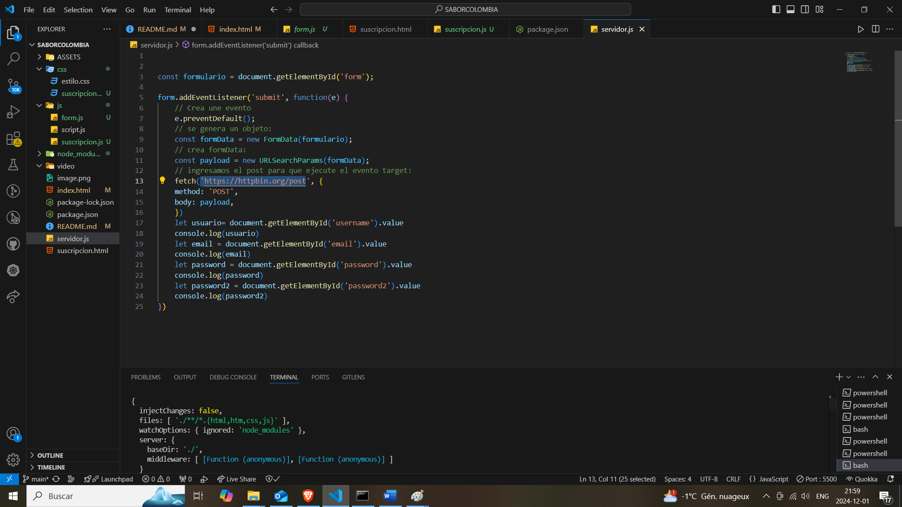

# Sabor Colombia
Es una página web en la que promociona **la gastronomía de colombia**, en ella puede encontrar los ingredientes que usa cada región del pais, los platos tipicos y los comentarios de usuarios sobre cada una de las comidas.

Este sitio web se diseño con los lenguajes de programación **HTML**, **CSS** y **JavaScript**, ademas se puede visualizar en diferentes dispositivos gracias al diseño responsive y los estilos en CSS como: Flexbox, grid y media queries.

Tambien se desarrollo la parte del back-end con node.js, creando una api y utilizando el fetch para crear un formulario que muestre los datos del usuario.

## Instrucciones
- **Paso 1:** Instalar Node js y lite server
- **Paso 2:** Inicializar en el cmd o el terminal de Visual con la instruccion npm run dev

- **Paso 3:** En el archivo servidor se encontrara con el evento.target fetch, en la parte del fetch iniciar con 'https://httpbin.org/post incluyendo
metodo Post body payload

## Tech Stack

**Lenguajes de Programación:** HTML, CSS, Javascript , NodeJS.

**Entorno de Trabajo:** GitHub, Visual Studio Code, Readme.so y Navegador
Web.

## Authors

- [@Nayel2004](https://www.github.com/Nayel2004)
- UMB.(2024).Módulo 2 HTML CSS JS.
- Toquica D (19 noviembre 2024).Principios de diseño UI/UX [MP4]. Recuperado de  Clic para ver la grabaciónLinks to an external site.

